# Final Project Proposal

**GitHub Repo URL**: https://github.com/CMU-IDS-2022/final-project-this-can-be-said-ma

**Group members**

Wenxing Deng, Jiuzhi Yu, Siyu Zhou, Huiyi Zhang

## Problem Description

Stress is defined as a reaction to mental or emotional pressure [1]. It is probably one of the commonly experienced feelings, but it might be hard to share. Stress can be caused by a variety of sources includes uncertain future, discrimination, etc., and the coronavirus pandemic has risen as a substantial source of stress [2]. People from different age and/or socioeconomic groups may experience very different sources and symptoms of stress. In this project, we hope to bring a narrative of stress that enhances people’s understanding of it. The goal of the project is to have an in-depth understanding of the following questions: 

- What are the sources and impact of stress for people from different age groups and socioeconomic backgrounds? 
- What are the factors that correlate with stress level and how are they related?  
   - Delving into sleep quality: Stress is sometimes related to how well people sleep. What is the correlation between people’s sleep quality and stress levels? Can we detect stress levels from sleep quality?
- How is stress level reflected on people’s expression on social media? We will provide a stress level detection service that takes in users’ text inputs. 
When the stress level turns to be overwhelming, what are tips for people from different age groups? 

We will first start with introductory visualizations that give users an overview of how people from different groups face different sources and symptoms of stress. Given this Kaggle dataset [3], users will be able to interactively zoom in to the groups of interest and explore survey results of stress among different age, gender, marital status, loan status, time spent on social media and sleep disorder situations. 

To understand the impact of stress, we plan to pick 1-3 factors and explore their correlation with stress level. For example, this kaggle dataset [4] illustrates people’s attitude towards music and the perceived stress level. In addition, Covid19 pandemic has caused high stress levels for many groups, among them students who experienced educational stress [5]. 

To further understand how stress level is related to and affected by those factors, we plan to delve deeper into the sleeping factor as an example. Given the dataset [6], we first plan to visualize the correlation between stress and the quality of sleep, in terms of snoring rate, heart rate, body temperature, and sleeping hours. Second, based on the correlation and also sleeping data gathered by apple watch [7], which is a good representative of people’s sleeping patterns, we hope to figure out the deciding factors for improving sleep quality. Third, we plan to make some suggestions on how to change these sleeping patterns to improve the sleep quality, so as to reduce the overall stress level. 

​​After the user has fully understood the reasons for the formation of stress and the impact of stress on people, we plan to design an interactive function to detect the user's current stress situation. Users can know their stress level through our program, and at the same time, the function will personalize the user with customized stress relief suggestions. Our program will ask the user to input a sentence. After the system receives the text, it will use the machine learning model to analyze the text input by the user, and give the system a stress analysis of the sentence. We plan to use natural language processing (NLP) and machine learning methods to build stress classification models. This was inspired by the published paper called Dreaddit: A Reddit Dataset for Stress Analysis in Social Media [8]. We plan to use the Twitter and Reddit Sentimental analysis Dataset [9] to train the model. We believe this function will allow our program to interact with users in an interesting way and give them a clearer picture of their stress situations and personalized care advice. It makes our program not only educational, but also allows users to know their stress situation and guide them through ways to reduce the negative effects of stress.

For people of different ages, we will provide corresponding tips for reducing stress. Although we can provide general tips like exercising and eating healthy food for ages, we plan to provide more detailed and specific tips. For example, we will recommend kids and teens who age from 6 to 17 exercise at least 60 minutes a day. But for older people, we will suggest they take 40-minute walks three days per week as their physical conditions may not allow them to exercise much. And for the diet suggestions, we will recommend kids and teens eat an abundance of vegetables, fish, nuts and eggs. While we will ask the young adults to reduce their alcohol, caffeine, sugar intake. And for older people, we will suggest they avoid sugar as overconsumption of sugar has a direct correlation to obesity, diabetes and even death.

## Sketches and Data Analysis

**What are the sources and impact of stress for people from different backgrounds?**

We will use a dataset collected from a mental health survey for general analysis.

*Mental Health Checker*

The survey consists of 36 questions and has 207 interviewees. Here are the 36 questions of the survey.

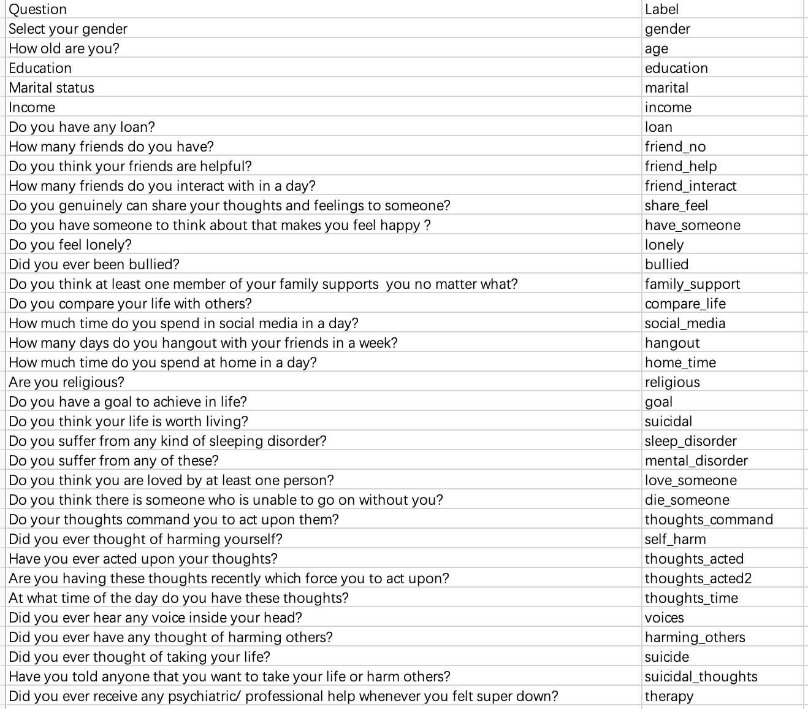

For this dataset, we don’t have substantial data to clean up. We will first filter out columns that we won’t analyze. Then we will select some of the features from the 36 questions and then clean some rows with invalid content.

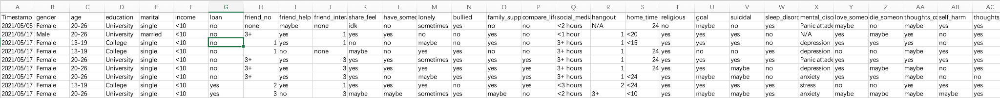

We will explore the following columns: 
Gender, age, marital, income, loan, social_media, sleep_disorder, mental_disorder and therapy.
Other columns are filtered out as some columns provide less diverse information since this is a small dataset.

We will first present bar charts to show whether stress level has specific relationships with gender, age, marital status, income level, loan, time spent in social media a day and sleep disorder. Then we will present a series of pie charts to visualize the percentage of people seeking therapy with different mental disorder levels.

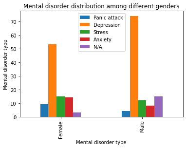

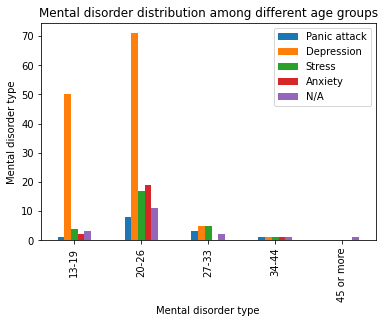

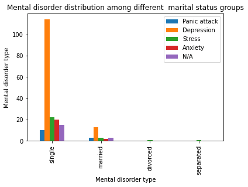

We can see that younger people and singles have higher probability to have mental disorders. But for most of the young people, more of them have depression rather than stress. An interesting point is that a higher proportion of people who age from 27 to 33 have stress compared to other age groups.

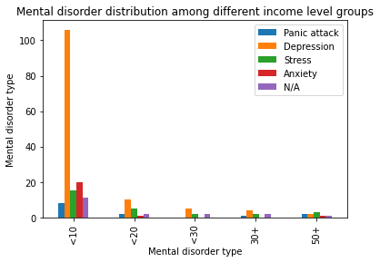

People with different levels of income all have mental disorders, but people in the lowest income level tend to have more mental disorders.

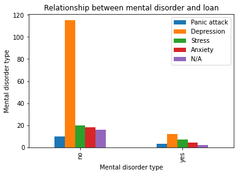

It seems that whether having a loan or not may not directly lead to mental disorders.

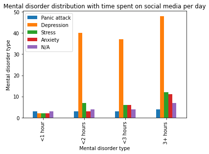

People who spend more time on social media per day have more stress and anxiety.

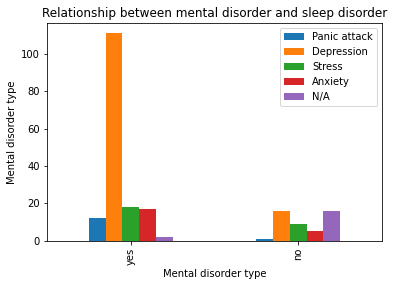

People who have mental disorders are more prone to have sleep disorders.
From the figures presented above, we can see that mental disorders are influenced by many factors. To be more specific, stress as one of the mental disorders that are related to different aspects of life, we plan to analyze the stress origin of an individual from a broad perspective and provide corresponding tips.

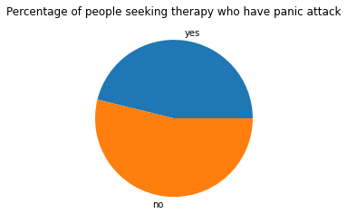

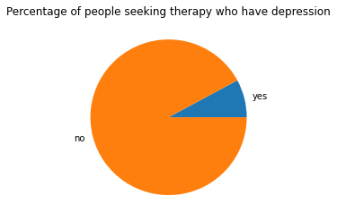

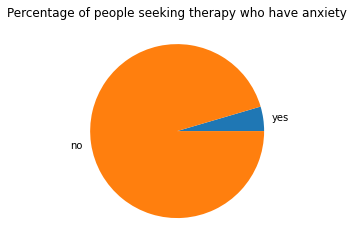

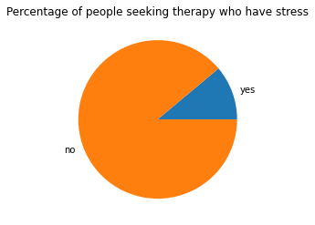

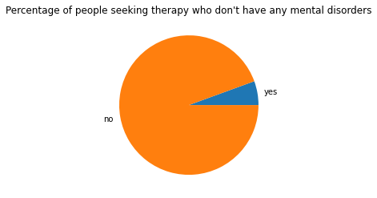

We can figure that people most of the people seek a therapy when they have panic attacks. But only a small portion of people with depression, anxiety and stress go to therapy. We want to encourage people with mental disorders seek appropriate therapy when they are not feeling very well through our project.

**What are the factors that correlate with stress level and how are they related?**

We will use the dataset to explore how the covid 19 pandemic is correlated with stress level. 

*COVID-19's Impact on Educational Stress*

No substantial data cleanup is needed since the dataset is clean and complete. We plan to explore the correlation between Covid-19 pandemic and the stress level experienced by students. We will examine the change in stress level before and after the pandemic and see whether other factors such as gender, age, and school environment affects it. 

We will display the data using group-by or creating pivot table and show how stress is reflected in class work, homework, and homework hours. The users will be able to interact with the visualization by filtering factors such as category of school (e.g. school/college training or home school). 

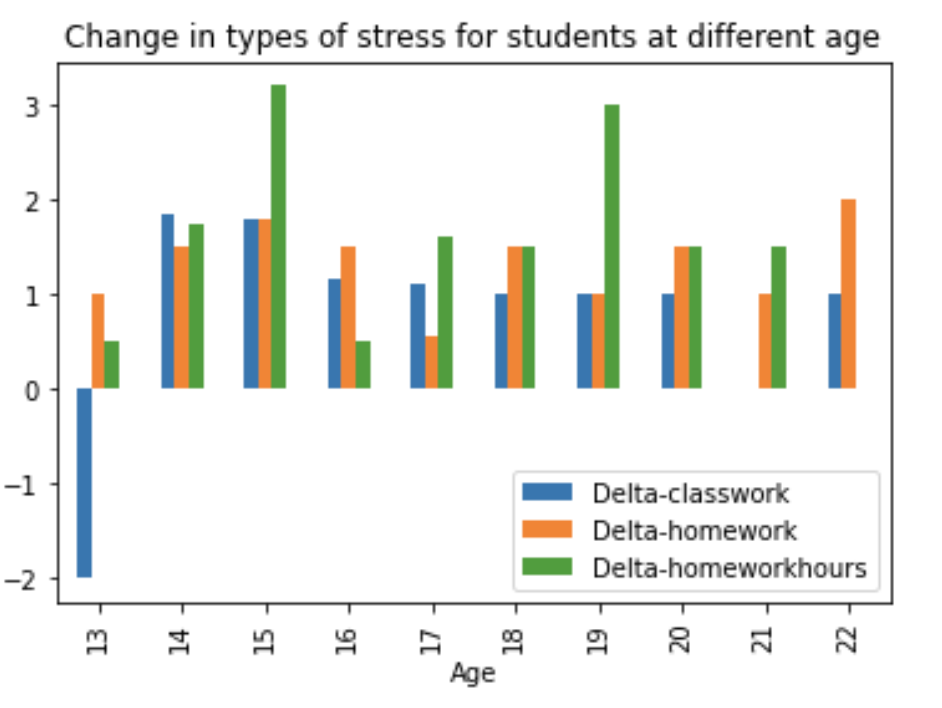

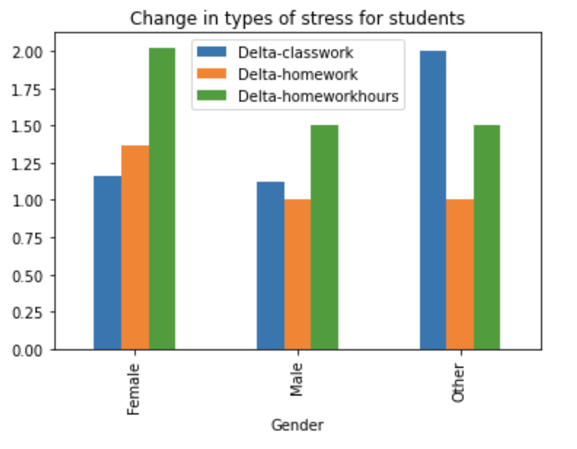

*Relationship between Sleep and Stress*

For the sleep related data, we plan to first show how sleep can affect the stress levels in terms of body temperature, sleeping hours, heart rate, and etc. Then we will analyze how the sleeping quality can be influenced by some factors such as number of walks, time to go to bed and wake up, drinking tea or coffee, working out, and etc.

For the relationship between sleep and stress levels, the dataset is already pre-cleaned. Therefore, no further data cleaning is needed. First, we will show some general relationship between each factor and stress level, as shown in the figure below. Next, to allow users’ interaction with the dataset, we plan to provide drop-down lists for users to choose the distribution of stress level and other features for a certain group of people.

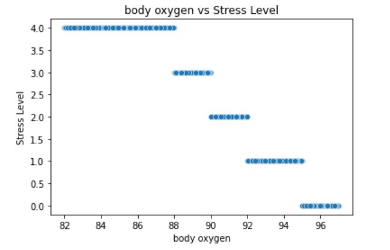

For the sleeping quality factors, the dataset needs to be cleaned. The original dataset is:

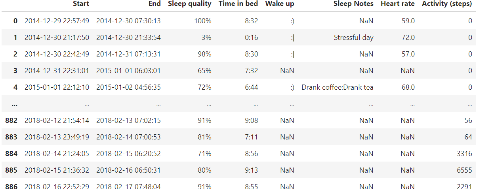

The cleaning procedures:
1. Change the start and end to datetime.time objects. This will allow further binning them into different time intervals.
2. Parse the sleep quality and time in bed to float.
3. Break the sleep notes into different categories, and add one-hot variables for all categories.
4. Drop the “Wake up” column, because there are more than 80% of null values.
5. Fill the null value for heart rate with 0.

The result table:

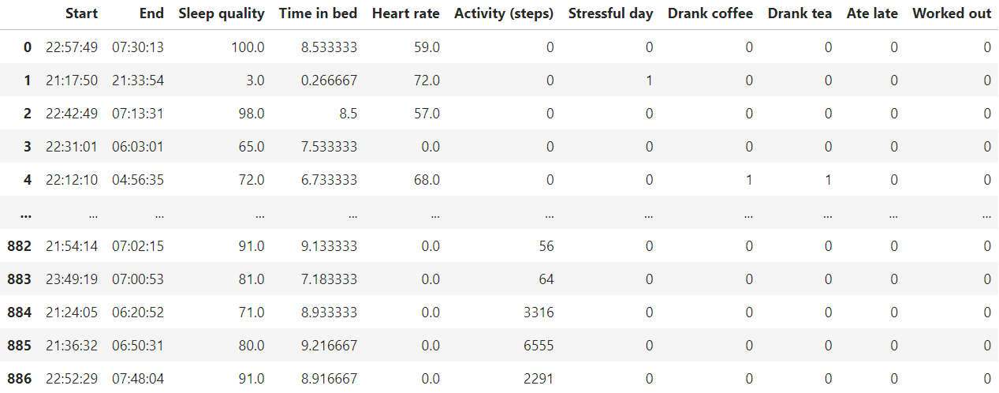

For the display of the data, we plan to show the correlation between sleep quality and other attributes. Also, users will be able to select several features and the values or intervals they are interested in to explore the fine-grained distribution. Several examples are shown below:

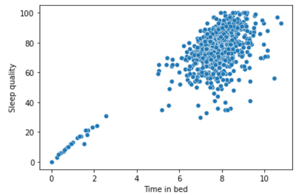

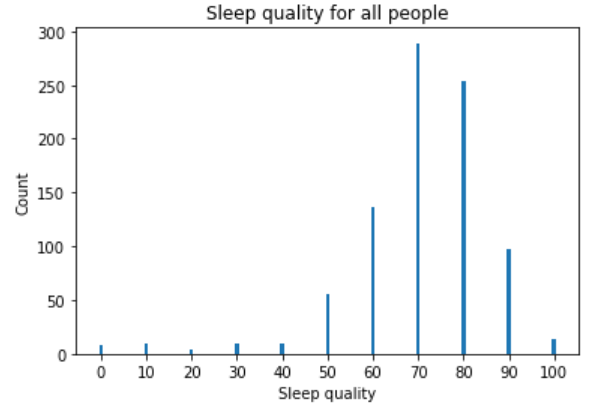
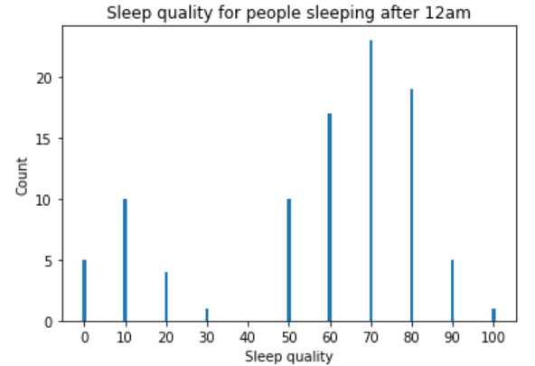

**How is stress level reflected on people’s expression on social media? We will provide a stress level detection service that takes in users’ text inputs.**

For the Sentiment analysis part, the data we used is 3.5K total segments taken from 3K posts using Amazon Mechanical Turk [7].

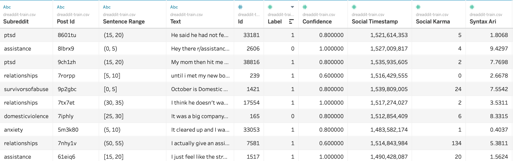

We have a total of 2,838 train data points and 51.6% labeled stressful. The dataset includes ten total subreddits and because some subreddits are more or less popular, the amount of data in each subreddits varies.

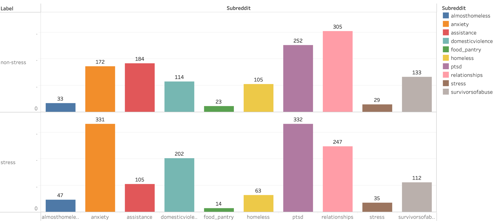

For data processing of this part, we remove punctuations, stop words and Lemmatization. We hope to get possible words that can express user pressure from a complete tweet - it does not need to be a grammatically complete sentence, but a paragraph composed of different words text. We hope to be able to use this data to train the model [10] to evaluate stress levels of the posts.

During the data preprocessing stage, we use the model [10] to tokenize the contents of the posts and remove the strings that contain punctuations, numbers or only single letter, conduct lemmatization on the list of tokens so that different inflected forms of a word can be analyzed as a single item and remove the stopwords from the list of tokens. 

After data preprocessing, we get the word cloud plot based on the training set. 

Non_stress_post_words:

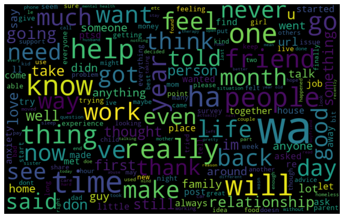

Stress_post_words:

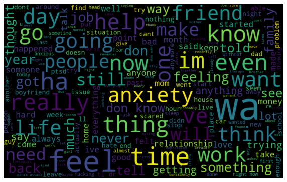

We can intuitively see which words are closely related to stress through the word cloud plot. We believe that visualizations such as word clouds can clearly show which features lead the system to judge user stress. Therefore, we design that after the user enters the words, the system analyzes the stress level of his statement and gives the user a word cloud plot of his text.

## Dataset & References

[1] https://www.nhs.uk/mental-health/feelings-symptoms-behaviours/feelings-and-symptoms/stress/#:~:text=Causes%20of%20stress,such%20as%20adrenaline%20and%20cortisol.

[2] https://www.apa.org/news/press/releases/stress/2020/report-october

[3] https://www.kaggle.com/datasets/faruqui682/mental-health-survey

[4] https://www.kaggle.com/datasets/tineeeeey/perceived-stress-level-and-attitude-towards-music

[5] https://www.kaggle.com/datasets/bsoyka3/educational-stress-due-to-the-coronavirus-pandemic

[6] https://www.kaggle.com/datasets/laavanya/human-stress-detection-in-and-through-sleep?select=SaYoPillow.csv

[7] https://www.kaggle.com/datasets/danagerous/sleep-data

[8] https://arxiv.org/abs/1911.00133

[9] https://www.kaggle.com/datasets/cosmos98/twitter-and-reddit-sentimental-analysis-dataset

[10] https://github.com/gillian850413/Insight_Stress_Analysis
