# Final Project Report

**Project URL**: https://share.streamlit.io/cmu-ids-2022/final-project-this-can-be-said-ma/main

**Video URL**: https://github.com/CMU-IDS-2022/final-project-this-can-be-said-ma/blob/main/video.mp4

<!-- Short (~250 words) abstract of the concrete data science problem and how the solutions addresses the problem. -->

In today's society, stress is gradually becoming a more prevalent emotion. Throughout life, we frequently hear family and friends lament the amount of pressure they are under to study, work, or deal with peer pressure and so on. While the majority of us experience varying degrees of stress from a variety of sources, only a small percentage of us understand how stress occurs and how to scientifically reduce it. Our ability to prevent stress and assist those closest to us in reducing stress will be enhanced only if we have a firm grasp on what causes stress and how to alleviate it. In this age of big data, an increasing amount of data is being collected in order to gain a better understanding of stress. We reviewed a number of articles and analyzed stress-related datasets that were referenced in the articles. We are particularly interested in the factors that contribute to stress in these datasets, as well as the effects and manifestations of stress on individuals. As a result, in our application, we propose to introduce stress from the source and factor perspectives. Additionally, users can input everyday language, such as tweets, into a machine learning model that analyzes their stress levels and prompts them as needed. We hope that our interactive application will educate users about stress and provide support to those who are experiencing stress or anxiety.

## Introduction
Stress is defined as a physiological response to mental or emotional strain [1]. It is probably one of the commonly experienced feelings, but it can be difficult to share. Stress can be triggered by a variety of factors, including uncertainty about the future, prejudice, and so on, and the coronavirus pandemic has emerged as a significant source of stress [2]. Individuals of varying ages and socioeconomic statuses may experience a wide variety of stressors and symptoms. We hope that this project will provide a narrative about stress that will help people better understand it.

Besides, we intend to design an interactive function that can identify the user's current stress level in order to help them better understand the pressure. As a lot of stress is invisible, users may not be aware that they are anxious or stressed out. Users may gain a better understanding of their mental state by using our program to test their stress levels. As a result of our app, we hope to assist users in identifying when they are stressed and taking steps to alleviate it.

## Related Work
When individuals are placed in a stressful situation, their bodies initiate a physical response. Their nervous system will activate and release hormones that will prepare them to fight or flee. This is why stressed individuals may exhibit the following symptoms: their heartbeat accelerates, their breathing becomes more rapid, their muscles tense, and they begin to sweat. If the stress is short-term and temporary, the body usually recovers quickly from it. However, if the stress system is activated indefinitely, it can result in or exacerbate more serious health problems. Continuous exposure to stress hormones accelerates the aging process and makes people more susceptible to illness. According to Seeman et al.[3], chronic stress causes "wear and tear" on the adaptive regulatory systems, resulting in biological changes that compromise stress adaptive processes and increase disease susceptibility.

Research has shown that stress influences people’s lives from various aspects. According to [4], higher numbers of stressful events over the lifetime was associated with excessive alcohol use, smoking, and a higher BMI after controlling for age, race, gender, and socioeconomic status variables.

The article [5] suggests that stress may have a detrimental effect on eating patterns such as skipping meals and restricting intake. Stress can result in an increase in fast food consumption [6], snacking [7], and calorie-dense, highly palatable foods [8].

### Covid-19 Datasets
**COVID-19's Impact on Educational Stress [9]** This dataset contains student responses to a public survey about educational stress. The data is collected for the purpose of learning the change in educational stress experienced by students worldwide prior to and following the Covid-19 pandemic. Educational stress is reflected through classwork stress, homework stress, and hours spent on homework. The dataset collects basic demographic data as well as information about the students' learning environment (physical, virtual, or hybrid), self-rated family relationships, and self-rated friend relationships prior to and following the pandemic. While we recognize that the dataset is small in size, it provides an excellent representation of students' self-reported stress levels and changes in life experiences.

**COVIDiSTRESS [10]** This dataset is sourced from the collaborative COVIDiSTRESS Global Survey to obtain an understanding of people’s experience between March 2020 and May 2020. As outlined in the article *COVIDiSTRESS Global Survey dataset on psychological and behavioural consequences of the COVID-19 outbreak* [10] , the responses are collected from people aged 18 or older from 39 countries and can be used for cross-cultural psychological and behavioral research. The dataset contains demographic background information, perceived stress level (PSS-10), as well as additional social science measures such as ability of social provisions (SPS-10) and self-report scale of loneliness (SLON-3). Moreover, it surveys proximate effects of the pandemic, such as current risk of infection, current isolation status, etc. For our project, we will focus on stress and the factors that influence perceived stress. Additionally, we recognize that this dataset is dense with psychological and behavioral context, making it an excellent resource for future research on Covid-19's influence.

### Sleep Datasets
**SaYoPillow [11]** The purpose of this paper is to propose the development of a smart IoT pillow that can automatically collect and attempt to track the user's sleeping data. The data collected will be used to forecast the next day's stress level and will also be used to make sleeping suggestions. The authors stated in the paper that the Smart-Yoga Pillow (SaYoPillow) will be used to monitor sleep hours, snoring range, respiration rate, heart rate, blood oxygen range, eye movement rate, limb movement rate, and body temperature. Then, these raw data will be used to train a model for predicting the stress level using a two-layer neural network with fully connected layers. The model will then be used to provide useful feedback to the user in order to help them sleep better. We primarily use the dataset from their experiment to demonstrate the relationship between sleep and stress in our project.

**Personal Sleep Data from the iOS App Sleep Cycle [12]** This dataset was gathered from Northcube's Sleep Cycle iOS app between 2014 and 2018. Numerous attributes are included in the data to describe the sleeping patterns, including the start and end times, the amount of time spent in bed, and the heart rate. Additionally, it includes a sleeping note that allows the user to enter his or her own lifestyle habits, such as drinking coffee or tea or exercising regularly. Finally, it includes a sleep quality rating on a scale of 0 to 100. This dataset is being used by our project to investigate potential methods for improving sleep quality.

### Stress Detection Datasets
We have studied stress-related articles and are aware that cortisol levels in saliva [14], electroencephalogram (EEG) readings [15], and speech data [16] can indicate a person's level of stress, but we are unable to include these approaches into our program. As a result, we examined papers that detect stress levels via word input, such as *Attention-Based LSTM for Psychological Stress Detection from Spoken Language Using Distant Supervision* [17], which employs Long Short-Term Memory Networks (LSTMs) to detect stress in speech and Twitter data, and *Detecting Stress Based on Social Interactions in Social Networks* [18], which employs a Convolutional Neural Network (CNN) to detect stress on microblogging websites. Following the comparison, we use the dataset from *Dreaddit: A Reddit Dataset for Stress Analysis in Social Media* [13], as Reddit's data is typically longer and more suited for discovering implicit features. The dataset contains a total of 2,838 train data points and 51.6% labeled stressful. The dataset [13] includes ten total subreddits and because some subreddits are more or less popular, the amount of data in each subreddits varies.

## Methods
### Sources of Stress
In the first section, we analyze stress sources in general using the **Mental Health Checker [19]** dataset from a mental health survey. The survey consists of 36 questions and interviews with 207 respondents. Each question is connected to a relevant factor that can result in varying degrees of mental disorder. We chose seven typical variables for this dataset: gender, age, marital status, income level, loan, daily time spent on social media, and sleep disorder. Then, we filter out columns containing factors that will not be analyzed in this project and clean up rows with invalid data. We chose to visualize the relationships between various mental disorders and specific factors using bar charts. By employing bar charts, we can easily analyze the number of people in various groups and compare the distribution of people with mental disorders. The column indicating whether people sought any type of therapy is also reserved for future research on the percentage of people seeking therapy at various levels of mental disorder. We chose pie charts to illustrate the percentage of people seeking therapy for various mental disorders because they make it easier to visualize the percentage of people seeking therapy for a particular mental disorder.

### Factors Correlated with Stress: Covid-19
In this section, we concentrate on the impact of the Covid-19 outbreak as a significant source of stress over the past two years. The first section concentrates on educational stress experienced by students from age 13 to 22, while the second part discusses how Covid-19 affects people of age 18 or older worldwide.  

To explore the educational stress, we present histograms depicting the distribution of classwork and homework stress prior to and following the pandemic. Users can specify the gender attributes as well as the educational environment prior to the pandemic to gain insights into the change in stress distribution for specific groups. With change in stress level data as well as change in family or friend relationship data, we provide users with an interactive visualization that shows the correlation between these factors. Users can view a heatmap of data distribution across two factors on the right after selecting a pair of factors. The corresponding heatmap is created by transform-filtering the selected features, splitting each feature into short intervals, and creating square blocks. It serves as a visual representation to the correlation coefficient on the left. 

We then create visualizations that emphasize the stress and other psychological factors experienced by adults. In the first plot, we show the distribution of perceived stress by allowing users to select a dimension from the drop-down menu. The users can choose among employment status, education level, mother’s education level, gender, marital status, and risk group. The bar chart will display the average perceived stress for each category in the selected dimension. The bar chart is enhanced with a single altair selection that is linked to the histogram below. The user can view the distribution of stress for people in a particular category (e.g. single in marital status) by clicking on the bar for that category.

The following two visualizations (1.2.2 and 1.2.3) examine the relationship between stress and other psychological or social variables. 1.2.2 shows a scatter plot of stress and self-reported scale loneliness, while 1.2.3 shows a scatter plot of stress and ability of social provisions. The users can select the dimension of interest, such as employment status or gender, from the  drop-down menu, and the scatter plot will add the selected feature as its legend. Given the difficulty of extracting useful information from a scatter plot with a large number of data points, we implement an interval selection interaction that enables users to select a region in the scatter plot and view the population composition from the perspective of the selected dimension.  The application enables the user to delve deeper into the area of interest and identify the group of people who are most influenced by the pandemic.

### Factors Correlated with Stress: Quality of Sleep
In this section, we first explore the relationship between sleep and stress and then move on to examine how to improve the quality of sleep.

For the first part, we primarily use bar charts with the sleeping characteristics on the x-axis, the count on the y-axis, and the stress levels color-coded. Users can select attributes from a drop-down menu and then explore them individually.

In the second section, we use scatter plots to represent various attributes such as time in bed, start and end times, heart rate, and activity (steps), with the attributes on the x-axis and sleep quality on the y-axis. Users can view additional attribute distributions for these data points by selecting a range in the start time chart. Additionally, we show a bar chart for sleep quality, which represents the distribution of sleep quality for the population selected. Users can easily select the population to examine by manipulating lifestyle attributes such as coffee consumption, tea consumption, late eating, and exercise. These characteristics may assist the user in establishing a healthier lifestyle that results in improved sleep quality. Users can also select the sleep quality range they are interested in to gain a better understanding of the characteristics of high and low sleep quality groups.

### Stress Detection
In order to complete the stress detection part, our program will require the user to enter a statement. The system will apply a machine learning model to assess the paragraph if it is entered by the user, and the system will then provide the user with a stress analysis. Natural language processing (NLP) and machine learning technologies will be used to create stress detection models. Classic classification models such as logistic regression, SVM, and random forest are used to extract features from text, TF-IDF, Word2Vec, and BERT models are then trained using the extracted features. 

Data processing is processed with punctuation, stop words and Lemmatization removed at various points along the way. Rather than a grammatically correct sentence, we're searching for suitable terms that show user pressure from the datasets - this does not have to be a single word, but rather a paragraph made up of many words. We intend to use this information to train the model that will be used to assess the stress levels of the employees working in the postings. To prepare for analysis, we tokenize the posts' contents and remove any strings that contain punctuation, numbers, or only a single letter. We also lemmatize the list of tokens so that different inflected forms of a word can be analyzed as one item, and we remove stopwords from the token list during the data preprocessing stage. Then, based on the degree of stress detected in the user's writing as well as the user's age information, we will give them personalized care and decompression recommendations. Our users are divided into three age groups: those between the ages of 6 and 17, those between the ages of 18 and 49, and those above 50. An if statement is used to determine which specific ideas are to be displayed in the output.

## Results
We begin the project by examining the sources and effects of stress on people from diverse backgrounds. When we examine age, income level, loan, and daily time spent on social media, we discover no discernible distribution differences. However, among the remaining three factors, there are some clear distinctions between groups. As illustrated in Figure 1, younger people have a higher risk of developing mental disorders. However, the majority of young people suffer from depression rather than stress. A noteworthy finding is that a greater proportion of people between the ages of 27 and 33 experience stress than other age groups. As illustrated in Figure 2, individuals with a lower income have a greater likelihood of experiencing anxiety, depression, or stress. As illustrated in Figure 3, a greater proportion of people with sleep disorders than those without sleep disorders suffer from various types of mental disorders.
<figure>
  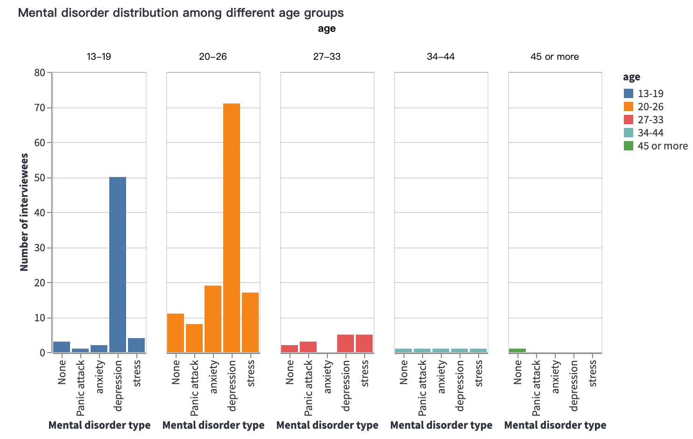
  <figcaption>Figure 1</figcaption>
</figure>
<figure>
  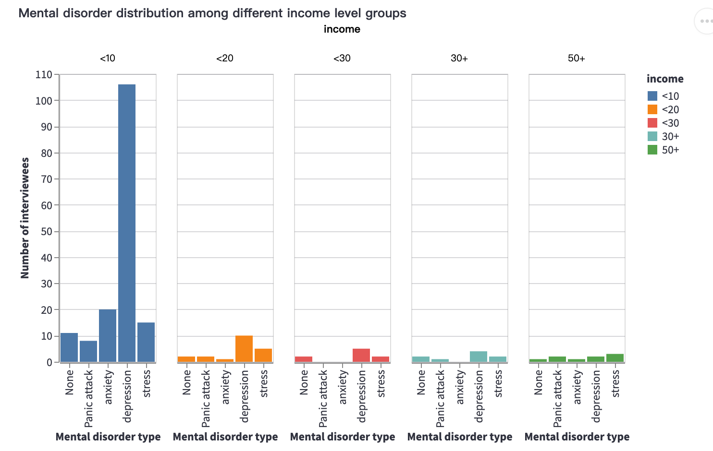
  <figcaption>Figure 2</figcaption>
</figure>
<figure>
  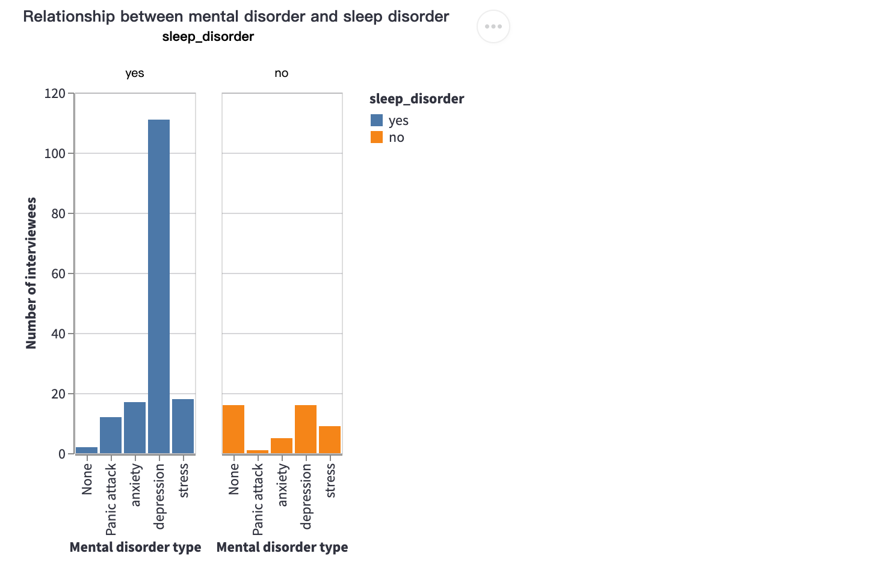
  <figcaption>Figure 3</figcaption>
</figure>

Then we analyze the proportion of people who seek therapy under different mental conditions. We find that many people seek therapy when they have panic attacks. However, only a small percentage of people who suffer from depression, anxiety, or stress seek therapy, implying that many people do not place a high premium on their mental illnesses.

### Factors Correlated with Stress: Covid-19
To address the question of how the Covid-19 pandemic affects people’s stress level and how they are related, we can use the application to explore the educational stress dataset. For example, the visualization in Figure 4(a) and 4(b) demonstrate that students, including those who have already studied in a virtual environment prior to the pandemic, experience a general increase in stress level. 
<figure>
  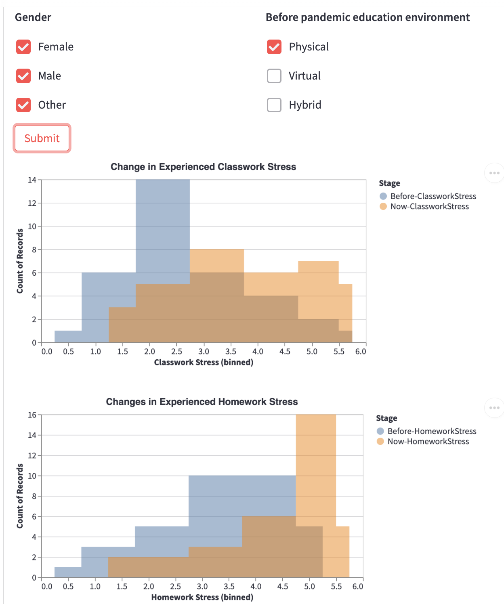
  <figcaption>Figure 4a</figcaption>
</figure>
<figure>
  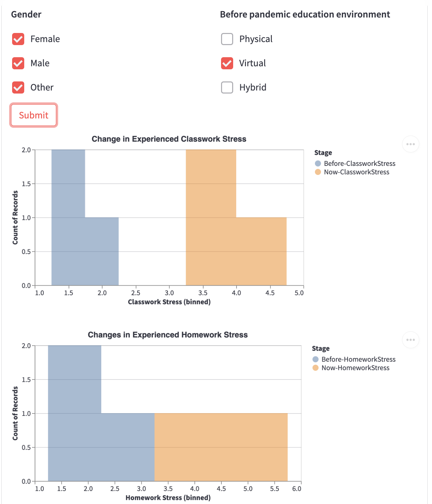
  <figcaption>Figure 4b</figcaption>
</figure>

The majority of respondents claim that they experienced negative changes in friend relationships after the pandemic. A natural follow-up question to ask is whether it is associated with increased classwork stress. From the correlation value of -0.08 and heatmap in Figure 5, we can see that there is no strong correlation between them. 
<figure>
  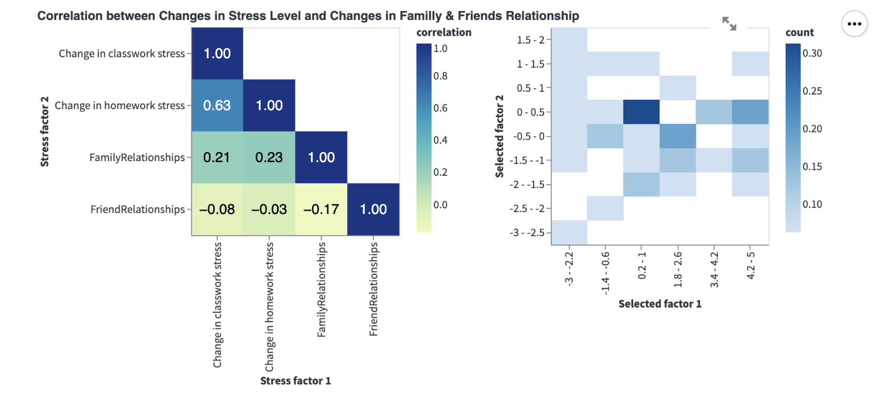
  <figcaption>Figure 5</figcaption>
</figure>

To illustrate how the pandemic affects different groups of people, we will look at educational background. While those with the fewest years of education (None) have a bell-shaped distribution of stress level as demonstrated in Figure 6(a), those with the highest level of education (PhD/Doctorate) have a right-skewed distribution and thus less stress overall, as shown in Figure 6(b).
<figure>
  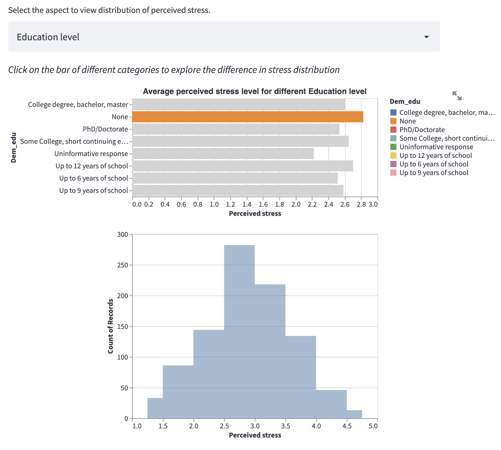
  <figcaption>Figure 6a</figcaption>
</figure>
<figure>
  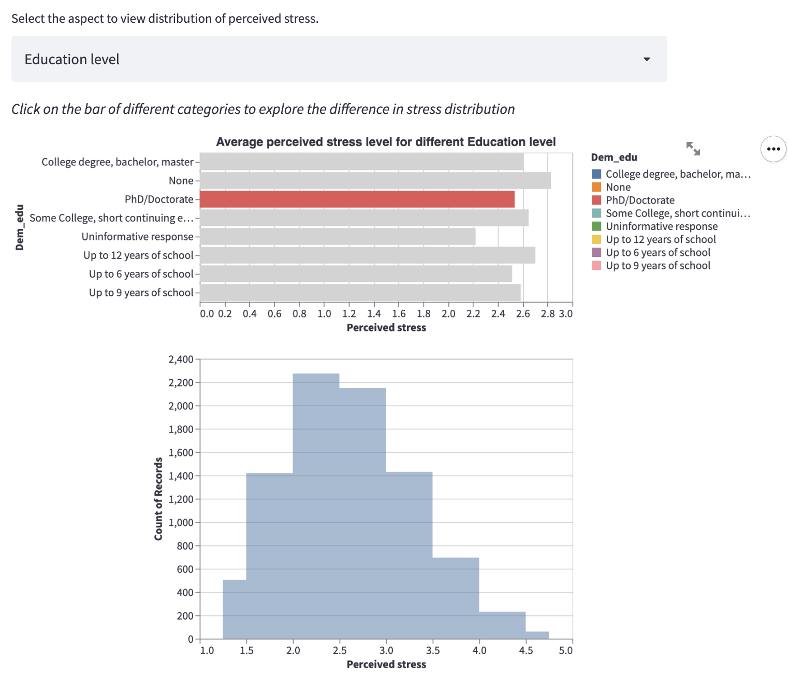
  <figcaption>Figure 6b</figcaption>
</figure>

The scatter plot of stress and social provision scale can be used to investigate the relationship of stress level and ability of social provision when other dimensions are considered. For instance, we can observe a negative correlation between stress and social provision in Figure 7(a), with unemployed accounting for less than 10% of the population. However, if we select the range of people with highest perceived stress and lowest social provision scale, as shown in Figure 7(b), the percentage of “not employed” people increased drastically to 23%. Thus, users can investigate the correlation while also taking into account other dimensions.
<figure>
  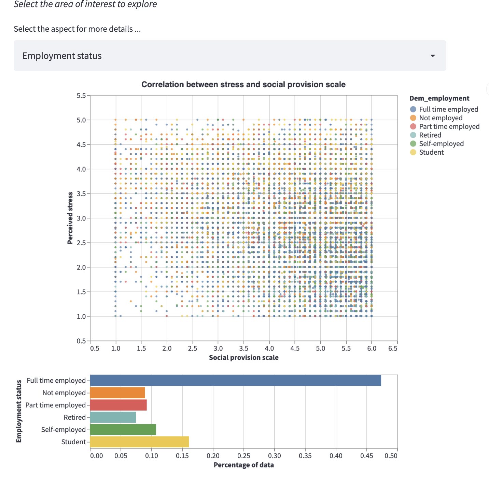
  <figcaption>Figure 7a</figcaption>
</figure>
<figure>
  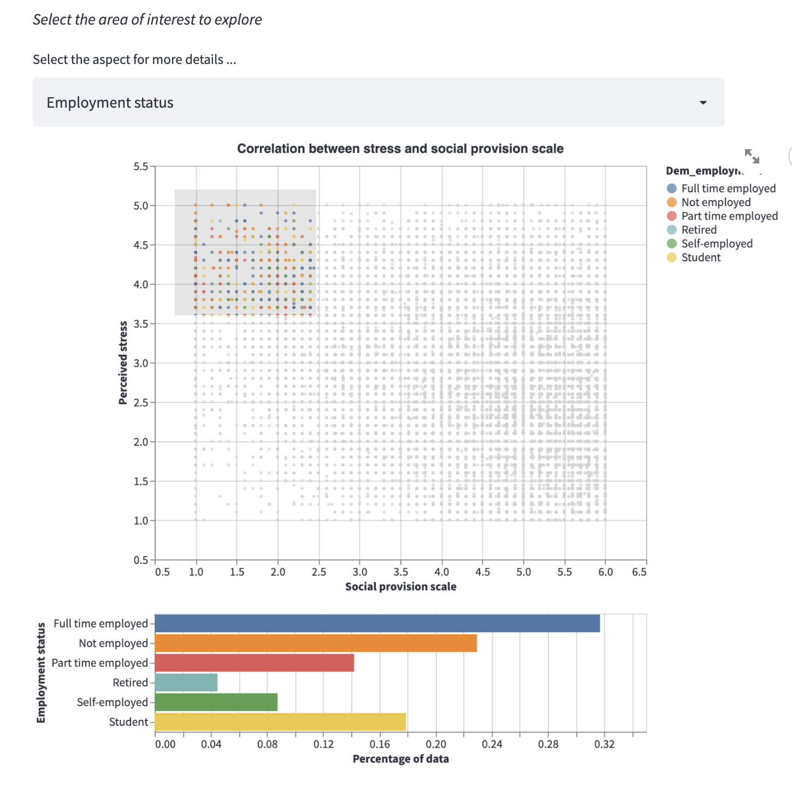
  <figcaption>Figure 7b</figcaption>
</figure>

### Factors Correlated with Stress: Quality of Sleep
For the sleep-stress relationship. A bar chart with color-coded stress levels is shown below for each of the eight attributes. As we can see from the sleeping hours chart, the stress level decreases monotonically as the number of sleeping hours increases. This pattern holds true for the remaining seven attributes as well. The monotonicity of the graphs reveals a strong correlation between sleep quality and stress levels.
<figure>
  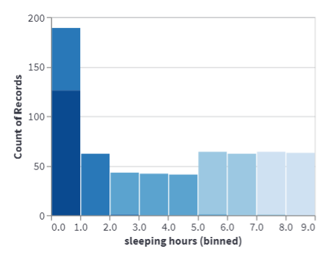
  <figcaption>Figure 8</figcaption>
</figure>

Following that, we'd like to demonstrate the relationship between sleep quality and lifestyle/sleep attributes. This collection of charts is intended to assist users in determining how to improve their sleep quality.

To begin, a summary of all the features is shown below in figure 9. The first chart depicts the distribution of sleep quality across the entire population. The majority of people receive a sleep quality score between 60 and 90. As evidenced by the second chart's attribute "time in bed", individuals who sleep longer than 6 hours can achieve a reasonable level of sleep quality, at least greater than 40. However, for those who sleep less than 4 hours, sleep quality is linearly related to bedtime. The second chart demonstrates that those who sleep after 12 a.m., or even around 6 a.m., experience extremely poor sleep quality. When we select these ranges (figure 10), we see that they still wake up around common hours, resulting in a very short period of sleep. These two characteristics contribute to extremely poor sleep quality.

Second, users can specify the sleep quality range they wish to investigate. For instance, as illustrated in figure 11, individuals may select the range 90-100. According to these charts, people typically sleep between 8 and 10 hours and go to bed between 9 and 12 a.m. The wake-up time is between 5 and 8 a.m. Their sleeping patterns are extremely "healthy" in general.

Third, users can specify which attributes to examine. For instance, they may wish to examine the sleeping patterns of individuals who exercise regularly (figure 12). The overall score is higher, and the standard deviation is also lower. Individuals who exercise regularly can maintain a fairly consistent start and end sleep time, as well as a consistent sleep time of more than 6 hours.
<figure>
  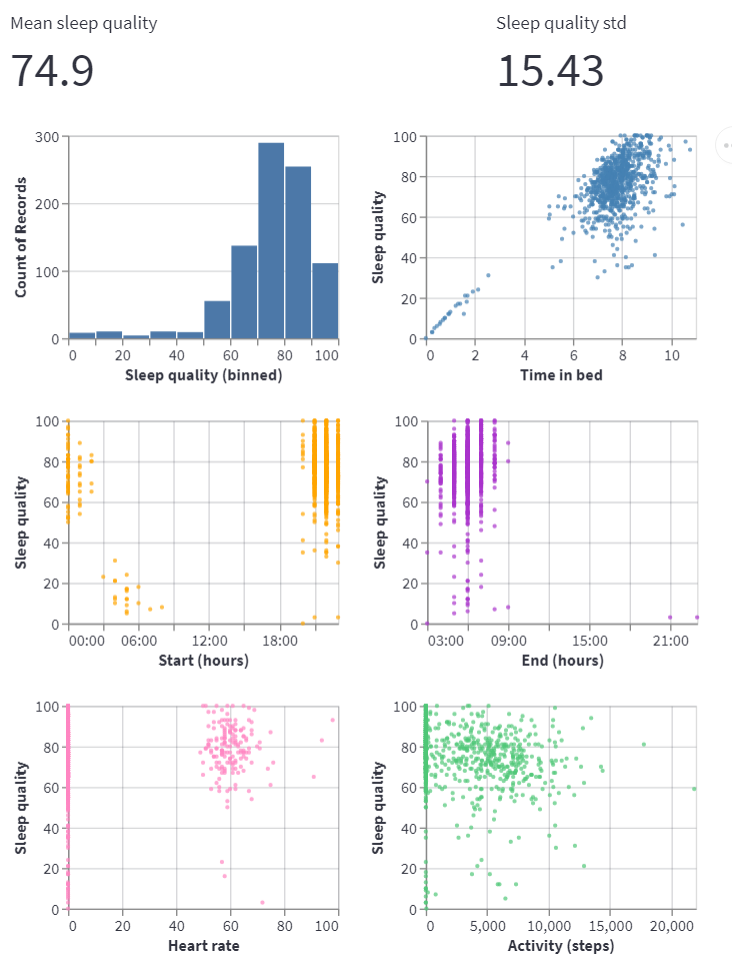
  <figcaption>Figure 9</figcaption>
</figure>
<figure>
  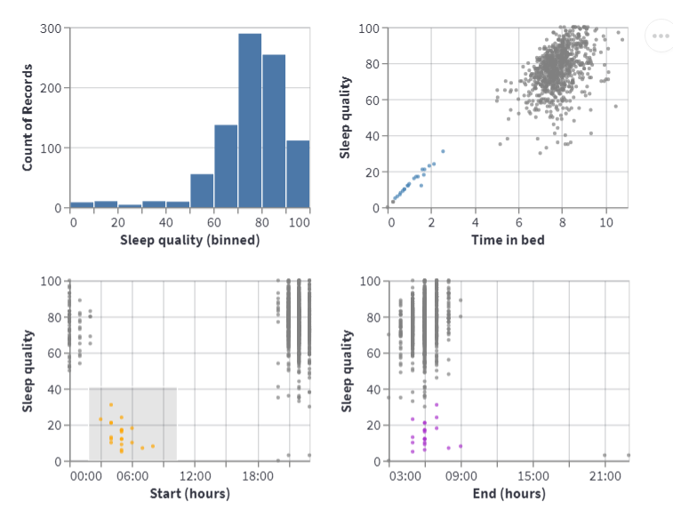
  <figcaption>Figure 10</figcaption>
</figure>
<figure>
  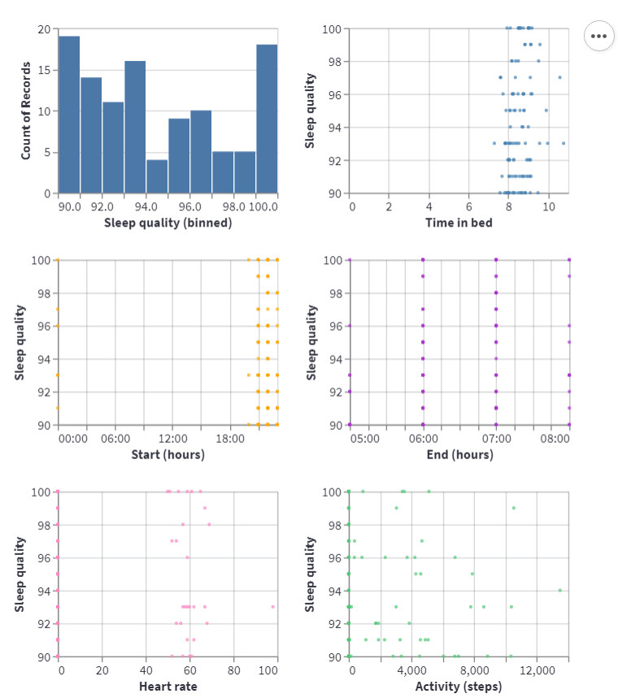
  <figcaption>Figure 11</figcaption>
</figure>
<figure>
  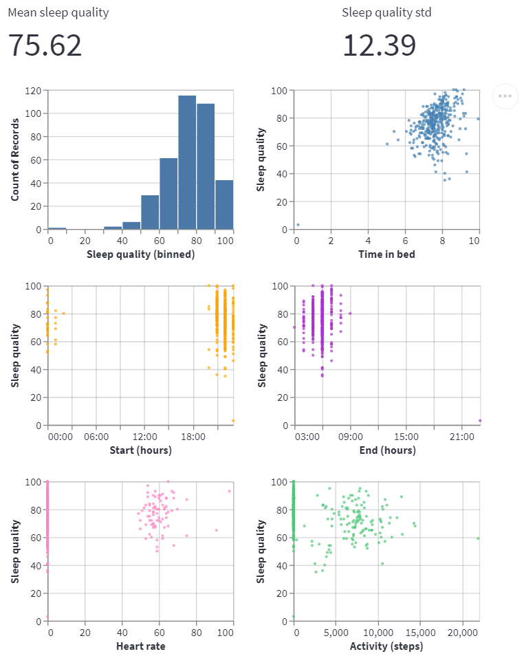
  <figcaption>Figure 12</figcaption>
</figure>

### Stress Detection
For the stress detection section, after preprocessing the data, we obtain the word cloud plot for the training set.
<figure>
  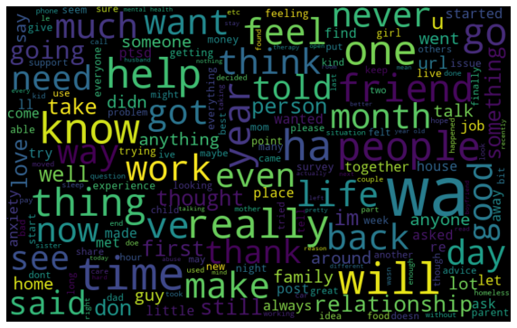
  <figcaption>Figure 13</figcaption>
</figure>
<figure>
  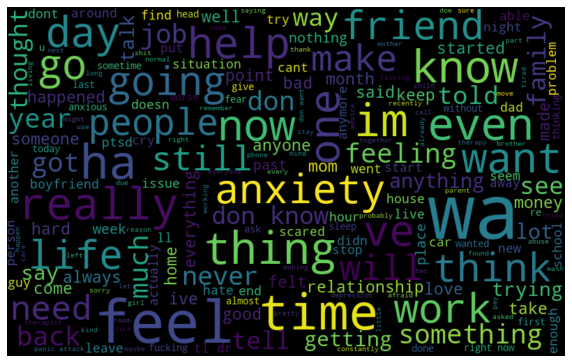
  <figcaption>Figure 14</figcaption>
</figure>

The word cloud plot enables us to intuitively see which words are strongly associated with stress. We believe that visualizations such as word clouds can clearly demonstrate which characteristics contribute to the system's assessment of user stress.

## Discussion
We propose a comprehensive system through which the audience can learn about stress and identify personal sources of stress. We hope that our work will help the audience gain a better understanding of stress in general, including the sources and distribution of stress in the population, how different factors such as Covid-19 and sleep affect stress levels, and how we can detect stress levels in plain text, such as tweets from users. Our program enables users to assess their level of stress while also customizing their experience with tailored stress relief suggestions. We hope that after exploring our application, our audience will identify some potential methods for reducing their stress levels, either through the factor analysis or the sentiment analysis sections.

## Future Work
When it comes to stress-related topics, we are shocked to discover that data, graphs, and algorithms can be utilized to investigate the numerous sources of stress, the various ways in which it appears, and the various ways in which it can be alleviated. We created this software in the expectation that it will help our users comprehend stress and themselves. Naturally, with future effort, we hope to continue assisting our users in comprehending stress.

When we discuss machine learning and artificial intelligence, we tend to think of them as “cold technologies”, but I believe that a well-designed artificial intelligence system must have a "human touch." For instance, our application combines natural language processing algorithms with quasi-personalized recommendations for individual users, allowing users to experience our application's care - we do not tell everyone the same set of recommendations, but rather provide tailored recommendations to individual users. I believe that this use of data and algorithms has a soul, and that it is in demand.

We intend to develop our application into an inventive and empathic product in the future, utilizing science and technology to address real-world problems faced by vulnerable groups in society, and allowing artificial intelligence to assist life. We intend to include our stress detection system into chat software or input techniques in the near future. Under the condition of maintaining user privacy and knowledge, we can automatically detect whether a user's chat content or text content written on a social platform reflects a high level of stress. If a high level of stress is detected, our program can provide targeted care to users in a timely manner, and regularly recommend users to complete some stress-relieving activities. Of course, in the future, we will continue to be concerned about user privacy and the legality of data collecting.  Additionally, we can extend the pressure detection in text to determine whether the user's voice or micro-expression indicates that the user is stressed using audio and video.

We expect that our future products will not only perform effectively when applied to machine learning, but will also provide a human touch to machine learning through thorough observation of our target users, which was also the initial objective of our product design.

## Reference
[1] NHS. (2019, October 15). Stress. NHS choices. Retrieved April 10, 2022, from https://www.nhs.uk/mental-health/feelings-symptoms-behaviours/feelings-and-symptoms/stress/#:~:text=Causes%20of%20stress,such%20as%20adrenaline%20and%20cortisol. 

[2] American Psychological Association. (2020, October). *Stress in america™ 2020: A National Mental Health Crisis.* American Psychological Association. Retrieved April 10, 2022, from https://www.apa.org/news/press/releases/stress/2020/report-october.

[3] Seeman, T. E., Singer, B. H., Rowe, J. W., Horwitz, R. I., & McEwen, B. S. (1997). Price of adaptation—allostatic load and its health consequences: MacArthur studies of successful aging. Archives of internal medicine, 157(19), 2259-2268.

[4] Sinha, R., & Jastreboff, A. M. (2013). Stress as a common risk factor for obesity and addiction. Biological psychiatry, 73(9), 827-835.

[5] Torres, S. J., & Nowson, C. A. (2007). Relationship between stress, eating behavior, and obesity. Nutrition, 23(11-12), 887-894.

[6] Steptoe, A., Lipsey, Z., & Wardle, J. (1998). Stress, hassles and variations in alcohol consumption, food choice and physical exercise: A diary study. British Journal of Health Psychology, 3(1), 51-63.

[7] Oliver, G., & Wardle, J. (1999). Perceived effects of stress on food choice. Physiology & behavior, 66(3), 511-515.

[8] Epel, E., Lapidus, R., McEwen, B., & Brownell, K. (2001). Stress may add bite to appetite in women: a laboratory study of stress-induced cortisol and eating behavior. Psychoneuroendocrinology, 26(1), 37-49.

[9] Benjamin Soyka. (2020). COVID-19's Impact on Educational Stress. Kaggle. https://doi.org/10.34740/KAGGLE/DS/1014717

[10] Yamada, Y., Ćepulić, DB., Coll-Martín, T. et al. COVIDiSTRESS Global Survey dataset on psychological and behavioural consequences of the COVID-19 outbreak. Sci Data 8, 3 (2021). https://doi.org/10.1038/s41597-020-00784-9

[11] L. Rachakonda, A. K. Bapatla, S. P. Mohanty, and E. Kougianos. (2021). SaYoPillow: Blockchain-Integrated Privacy-Assured IoMT Framework for Stress Management Considering Sleeping Habits” IEEE Transactions on Consumer Electronics (TCE), Vol. 67, No. 1, pp. 20-29.

[12] D. Diotte. (2020). “Sleep Data”. Retrieved from: https://www.kaggle.com/datasets/danagerous/sleep-data

[13] Turcan, E., & McKeown, K. (2019). Dreaddit: A Reddit dataset for stress analysis in social media. arXiv preprint arXiv:1911.00133.

[14] Andrew P. Allen, Paul J. Kennedy, John F. Cryan, Timothy G. Dinan, and Gerard Clarke. (2014). Biological and psychological markers of stress in humans: Focus on the trier social stress test. Neuroscience & Biobehavioral Reviews, 38:94124. 

[15] Fares Al-Shargie, Masashi Kiguchi, Nasreen Badruddin, Sarat C. Dass, and Ahmad Fadzil Mohammad Hani. (2016). Mental stress assessment using simultaneous measurement of eeg and fnirs. Biomedical Optics Express, 7(10):38823898. 

[16] Xin Zuo, Tian Li, and Pascale Fung. (2012). A mul-tilingual natural stress emotion database. In Proceedings of the Eighth International Conference on Language Resources and Evaluation (LREC-2012), pages 1174–1178, Istanbul, Turkey. European Language Resources Association (ELRA). 

[17] Genta Indra Winata, Onno Pepijn Kampman, and Pascale Fung. (2018). Attention-based LSTM for psychological stress detection from spoken language using distant supervision. CoRR, abs/1805.12307. 

[18] Huijie Lin, Jia Jia, Jiezhong Qiu, Yongfeng Zhang, Guangyao Shen, Lexing Xie, Jie Tang, Ling Feng, and Tat-Seng Chua. (2017). Detecting stress based on social interactions in social networks. IEEE Transactions on Knowledge and Data Engineering, 29(09):1820–1833. 

[19] S. M. Al Faruqui. (2021). “Mental Health Survey”. Retrieved from: https://www.kaggle.com/datasets/faruqui682/mental-health-survey
